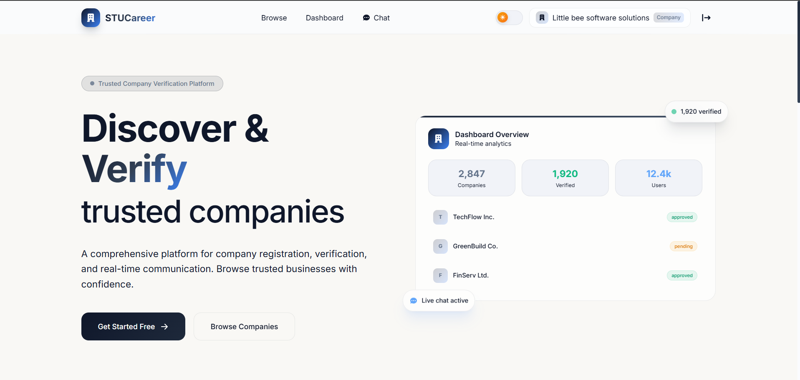

# 🎓 Student Career Portal 💼

🚀 A full-stack web application designed to bridge the gap between students and employers by streamlining job applications, company management, and professional networking.

---

## 📌 Overview

The **Student Career Portal** is a comprehensive platform that connects students with companies, providing an efficient environment for job discovery, recruitment, and communication.

This system focuses on:
- Improving student employability  
- Simplifying recruitment workflows  
- Enhancing interaction between students and companies  

---

## ✨ Features

### 👩‍🎓 Student
- Create and manage profile  
- Upload CV / Resume  
- Browse and apply for jobs  
- Track application status  
- Real-time chat with recruiters  

### 🏢 Company
- Create company profile  
- Post and manage job vacancies  
- View student applications  
- Shortlist candidates  
- Analyze application trends (charts & analytics)  

### 🛠️ Admin
- Manage users (students & companies)  
- Monitor job postings  
- Ensure platform security and performance  

---

## ⚡ Key Highlights

- 🔐 JWT Authentication – Secure login & role-based access  
- 💬 Real-time Chat – Powered by Socket.io  
- 📊 Advanced Analytics – Visual dashboards for insights  
- 🧪 Automated Testing – Selenium-based UI testing  
- 🎨 Modern UI/UX – Smooth animations using Framer Motion  

---

## 🧑‍💻 Tech Stack

### Frontend
- React.js  
- Tailwind CSS  
- Framer Motion  

### Backend
- Node.js  
- Express.js  

### Database
- MongoDB (Mongoose)  

### Real-Time Communication
- Socket.io  

### Testing
- Selenium  

---

## 📸 Screenshots

> Add your project screenshots here

```bash

